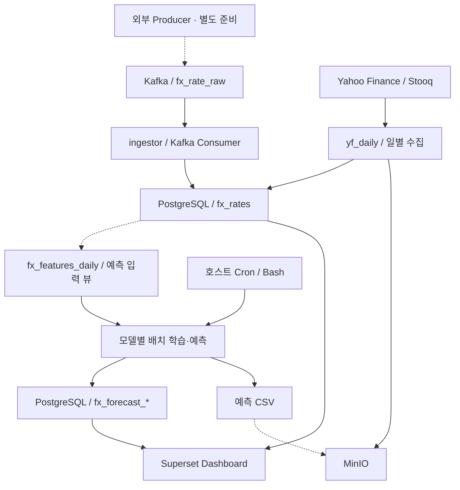

# 📈 Realtime FX Predict

**USD/KRW 환율 데이터 적재, 모델별 배치 예측, PostgreSQL 저장, Superset 시각화를 연결한 데이터 파이프라인 프로젝트입니다.**

[FX_predict](https://github.com/SolarHO/FX_predict)에서 진행한 시계열 분석과 모델 비교 실험을 바탕으로, 예측 작업을 컨테이너와 실행 스크립트로 연결하는 단계로 확장했습니다. 프로젝트의 핵심은 모델 정확도뿐 아니라 **데이터가 수집되고 예측 결과가 조회되기까지의 흐름을 구성한 경험**입니다.

> 이 저장소는 AWS EC2 기반 구축 과정의 코드와 대시보드 결과를 담고 있습니다. 현재 공개 코드에는 실행 환경 의존성과 개선 과제가 남아 있으며, 저장소만 내려받아 전체 시스템을 즉시 재현하는 단계는 아닙니다.

## Dashboard Preview


실제 환율과 모델별 예측을 한 화면에서 비교하고, 1일·5일·7일 예측 결과를 나누어 조회했습니다. 이미지는 구축 당시 결과이며 현재 서비스 가동 여부나 예측 성능을 보증하지 않습니다.

## Project Overview

| 항목 | 내용 |
| --- | --- |
| 대상 데이터 | USD/KRW 환율 시계열 |
| 수집·적재 | Kafka 메시지 소비, Yahoo Finance 일별 데이터 수집 및 Stooq 대체 경로 |
| 예측 | 선형 모델, LSTM, GRU, ARIMA / 예측 길이 1·5·7 |
| 데이터 저장 | PostgreSQL, MinIO 연동 |
| 실행 환경 | Python, Docker Compose, Linux, AWS EC2 |
| 스케줄링 | 수집 코드의 일일 스케줄, 예측 실행용 Bash 스크립트와 호스트 Cron |
| 시각화 | Apache Superset |
| 선행 프로젝트 | [FX_predict — 오프라인 환율 분석 및 모델 실험](https://github.com/SolarHO/FX_predict) |

## Project Evolution

### Phase 1 — 오프라인 분석과 모델 실험

선행 프로젝트에서는 거시·금융 변수와 환율의 관계, 학습 기간, 단변량·다변량 입력, 모델과 예측 기간에 따른 차이를 비교했습니다.

### Phase 2 — 수집·예측·시각화 연결

이 저장소에서는 다음 구현을 중심으로 실험을 확장했습니다.

- Kafka 메시지를 읽어 PostgreSQL에 적재하는 Consumer
- 외부 일별 환율 수집과 대체 데이터 소스 호출
- 모델·예측 길이별 컨테이너 실행 스크립트
- 예측 결과 UPSERT 및 CSV 생성·객체 스토리지 연동
- PostgreSQL을 데이터 소스로 사용하는 Superset 대시보드

선행 실험과 현재 파이프라인은 모델 구현 및 예측 기간이 일부 다릅니다. 선행 실험의 성능 순위를 현재 구현의 성능으로 그대로 적용하지 않습니다.

## Architecture



실선은 코드의 처리 경로이며, 점선은 별도 구성 또는 구현 보완이 필요한 연결입니다. 예측 CSV의 MinIO 저장 상태는 실행 경로에 따라 다릅니다.

### 1. Kafka 메시지 적재

[`ingestor/app.py`](ingestor/app.py)는 **Consumer**입니다. 외부 API 호출이나 Kafka Producer 역할은 이 파일에 구현되어 있지 않습니다.

- Kafka는 Compose에서 **KRaft 모드**로 구성하며 ZooKeeper를 사용하지 않습니다.
- 컨테이너 내부 접속 주소: `kafka:19092`
- 기본 토픽: `fx_rate_raw`
- 메시지 형식: `pair,price,ts`
- 메시지를 파싱한 뒤 PostgreSQL `fx_rates`에 UPSERT합니다.

현재 Consumer는 자동 offset 커밋을 사용하고, DB 처리 실패 시 rollback 후 오류를 출력합니다. 실패 메시지의 재처리와 DB 저장·offset 커밋의 일관성은 보완 과제입니다.

### 2. 일별 환율 수집

[`yf_daily/app.py`](yf_daily/app.py)는 Kafka 경로와 별도로 동작합니다.

- Yahoo Finance에서 최근 일별 종가를 조회합니다.
- 조회 실패 시 Stooq를 대체 소스로 사용합니다.
- PostgreSQL에 적재하고, 설정에 따라 `boto3`로 MinIO에 수집 CSV를 업로드합니다.
- 시작 시 수집한 뒤 설정한 시각에 반복 실행하거나, `--once`로 한 번 실행할 수 있습니다.

이 경로는 일별 데이터 수집입니다. 현재 저장 시각은 수집 실행 시각을 사용하므로 원천 데이터의 거래일과 수집 시각을 구분하는 개선이 필요합니다.

### 3. 모델별 배치 예측

[`bin/forecast_all_horizons.sh`](bin/forecast_all_horizons.sh)는 모델과 예측 길이를 조합해 컨테이너를 순차 실행합니다.

- 기본 통화쌍: `USDKRW`
- 기본 입력 길이: `CTX=96`개 관측값
- 예측 길이: `H=1`, `5`, `7`
- 예측 입력: `fx_features_daily`의 `kst_date`, `price`
- 실행 시 `forecast_image_src/app`을 컨테이너의 `/app`에 마운트

호스트 Cron에서 매일 09:07 KST에 실행하는 구성을 사용했습니다. Cron 등록은 Compose 외부 작업이며, 서버 시간대와 선행 수집 작업의 완료 여부를 함께 확인해야 합니다.

## Forecasting Implementation

| 실행 경로 | 현재 구현 | 다중 시점 예측 방식 |
| --- | --- | --- |
| [train_dlinear.py](forecast_image_src/app/train_dlinear.py) | `nn.Linear(CTX, H)`를 사용하는 단일 선형층 | H개 값을 한 번에 출력 |
| [train_any.py](forecast_image_src/app/train_any.py)의 LSTM·GRU | 단일 시점 출력 RNN | 예측값을 다음 입력에 붙여 H회 반복 |
| [train_any.py](forecast_image_src/app/train_any.py)의 ARIMA | ARIMA(1, 1, 1) | H개 시점 forecast |
| [train_any.py](forecast_image_src/app/train_any.py)의 dlinear 분기 | 단일 시점 출력 선형층 | 예측값을 다음 입력에 붙여 H회 반복 |

코드의 `dlinear` 이름은 기존 실행 설정과 모델 라벨입니다. 현재 위 경로의 구현은 **추세·계절성 분해가 없는 단순 선형 모델**이므로, 해당 구조를 포함한 DLinear 구현과 구분합니다.

현재 미래 날짜는 마지막 날짜에 달력일을 더해 생성합니다. 입력은 관측값 단위이므로 주말·휴장일 처리와 예측 날짜의 정합성은 추가 확인이 필요합니다.

## Storage & Visualization

### PostgreSQL

예측 코드는 H에 따라 저장 테이블을 선택합니다.

| H | 저장 테이블 |
| --- | --- |
| 1 | `fx_forecast_daily` |
| 5 | `fx_forecast_h5` |
| 7 | `fx_forecast_h7` |

`(kst_date, pair, model)`을 기준으로 UPSERT합니다. 같은 대상 날짜·통화쌍·모델을 다시 실행하면 기존 결과가 갱신되므로, 현재 구조는 모든 예측 실행 이력을 보존하는 구조는 아닙니다.

**현재 `y_true`에는 예측 대상일의 실제 값이 아니라 마지막 관측값이 저장됩니다.** 성능 평가에는 대상 날짜의 실제 환율을 별도로 연결해야 합니다.

### MinIO

| 경로 | 현재 상태 |
| --- | --- |
| `yf_daily/app.py` | `boto3.put_object`로 수집 CSV 업로드 |
| `forecast_image_src/app/train_any.py` | `mc` 명령으로 업로드 시도. 실패를 무시하므로 성공 검증 필요 |
| `forecast_image_src/app/train_dlinear.py` | 로컬 CSV 생성 및 업로드 대상 경로 출력. 실제 업로드 미구현 |

따라서 모든 모델의 예측 CSV가 MinIO에 정상 저장된다고 단정하지 않습니다.

### Superset

PostgreSQL의 관측값과 예측 결과를 연결해 다음 화면을 구성했습니다.

<details>
<summary>1일·5일·7일 예측 화면 보기</summary>

#### 실제 환율과 1일 예측


#### 5일 예측


#### 7일 예측


</details>

대시보드는 모델별 출력과 데이터 연결 결과를 확인하는 자료입니다. 곡선이 완만하거나 현재 환율에 가깝다는 이유만으로 모델 우열을 판단하지 않습니다.

## Infrastructure

단일 EC2에서 Docker 서비스를 연결하는 구성을 사용했습니다. PostgreSQL·Kafka·MinIO·Superset 데이터는 Compose의 named volume으로 관리합니다.

| 구성 요소 | 역할 |
| --- | --- |
| AWS EC2 / EBS | 컨테이너 실행 및 호스트 저장 공간 |
| Docker Compose | Kafka, PostgreSQL, MinIO, Superset, 수집 서비스 구성 |
| Bash / Cron | 예측 컨테이너 실행 및 일일 스케줄 |
| PostgreSQL | 관측값·예측 결과 저장과 BI 조회 |
| MinIO | S3 호환 객체 스토리지 |
| Superset | 실제 값과 모델별 예측 시각화 |

MinIO의 API 포트는 `9000`, 콘솔 포트는 `9001`입니다. Kafka·DB 등의 접근 범위와 자격 증명은 실행 환경에 맞춰 설정해야 합니다.

## Repository Guide

```text
.
├── bin/                       # 모델별·예측 길이별 실행 및 상태 확인 스크립트
├── ingestor/                  # Kafka Consumer → PostgreSQL
├── yf_daily/                  # 외부 일별 환율 수집
├── forecast_image_src/app/    # 전체 horizon 실행 스크립트가 마운트하는 코드
├── forecast/                  # 별도 예측 이미지 구성·코드
├── forecast_multi/            # 별도 예측 코드와 패치·백업 파일
├── sql/                       # 초기 스키마 및 예측 관련 SQL
├── docker-compose.yml
├── docker-compose.override.yml
└── README.md
```

예측 코드가 여러 디렉터리에 존재합니다. 실행 경로를 확인할 때는 먼저 [전체 예측 실행 스크립트](bin/forecast_all_horizons.sh)와 해당 컨테이너의 entrypoint를 확인해야 합니다.

## Reproduction Status

공개 저장소에는 기존 환경에 의존하는 설정이 남아 있습니다. 다음 조건을 준비한 뒤 실행해야 합니다.

1. **환경 변수와 자격 증명**  
   [Compose](docker-compose.yml)에서 참조하는 PostgreSQL·Kafka·MinIO·Superset 변수를 설정합니다. [override 파일](docker-compose.override.yml)의 고정 관리자 설정도 수정해야 합니다.

2. **수집 실행 환경과 메시지 입력**  
   Kafka 경로는 Producer와 토픽 입력이 필요합니다. `yf_daily`는 현재 Compose의 서비스 설정에 실행 파일 연결·실행 명령 보완이 필요합니다.

3. **DB 스키마·뷰·과거 데이터**  
   [초기 SQL](sql/init/001_schema.sql)만으로 예측에 필요한 모든 객체가 준비되지는 않습니다. `fx_features_daily`, 예측 대상 테이블, BI 조회 뷰와 충분한 과거 관측값을 준비해야 합니다. `fx_rates`의 기본키 정의도 초기 SQL·Consumer와 일별 수집 코드 사이에서 통일해야 합니다.

4. **예측 이미지와 Docker 네트워크**  
   전체 실행 스크립트는 `fxstack/forecast:any` 이미지와 `fx-stack_fxnet` 네트워크를 사용합니다. [app Dockerfile](forecast_image_src/app/Dockerfile)도 기존 이미지를 기반으로 하므로, 베이스 이미지의 준비와 entrypoint 확인이 필요합니다.

5. **객체 스토리지·대시보드·스케줄**  
   버킷과 업로드 도구를 준비하고, Superset 데이터 소스 및 차트를 구성합니다. 예측용 Cron은 별도로 등록합니다.

위 조건을 갖춘 기존 환경에서 전체 예측을 호출하는 명령은 다음과 같습니다.

```bash
bash bin/forecast_all_horizons.sh
```

스크립트는 호스트 환경 변수를 읽습니다. Compose가 읽는 `.env` 설정이 Bash 실행 환경에 자동으로 전달되는 것은 아닙니다.

## Evaluation & Next Steps

현재 README에서는 정량 검증이 완료되지 않은 모델 순위를 제시하지 않습니다. 다음 항목을 보완해 파이프라인의 재현성과 평가 신뢰도를 높일 계획입니다.

- [ ] 선형 모델의 전체 구간 표준화를 학습 구간 기준으로 수정하고, 다중 시점 타깃의 학습·검증 경계 중첩 점검
- [ ] 거래일·수집 시각·예측 대상일을 분리하고 실제 관측값과 예측 결과를 정확히 연결
- [ ] 동일 평가 구간에서 전일 값 유지 기준선과 모델별 MAE·RMSE 비교
- [ ] 시간 순서에 따라 학습·평가를 반복하는 walk-forward 검증 추가
- [ ] 예측 생성 시점과 horizon을 포함해 실행별 예측 이력 보존
- [ ] MinIO 업로드 구현 통일 및 실패 감지·재시도 추가
- [ ] Kafka 처리 실패 재시도와 offset 커밋 전략 개선
- [ ] 초기 SQL, 환경 변수 예시, 이미지 빌드 및 실행 절차 통합
- [ ] 중복 예측 코드·패치 파일 정리와 핵심 경로 테스트 추가

## Portfolio Focus

이 프로젝트에서 보여주고자 하는 경험은 **분석 실험을 데이터 파이프라인으로 확장하고, 데이터 적재·배치 실행·저장·시각화의 연결 지점을 다룬 것**입니다.

현재 구현과 개선 과제를 구분해 공개하며, 다음 단계에서는 재현 가능한 실행 환경과 공정한 모델 평가를 갖추는 데 집중합니다.

